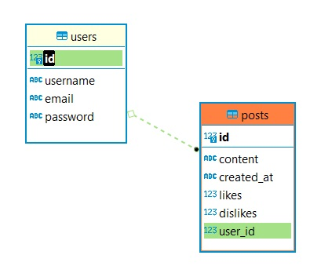

This is a Social Network App API that allows to do the following:

- User signup and login/get token
- Create/view/update/delete user posts
- Like/dislike posts

In order to launch the app:

1. Install the dependencies `pip install -r requirements.txt` 
2. Go to `/app` folder
3. Run the server `uvicorn main:app --reload`

Examples of HTTP requests are in `requests.http` file

API documentation and test scenarios can be found at [http://localhost:8000/docs]()

API database schema is provided below:

